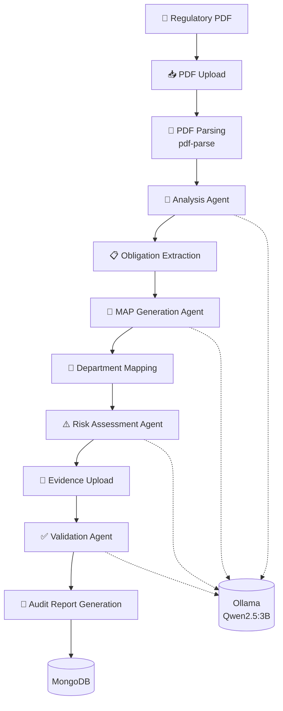
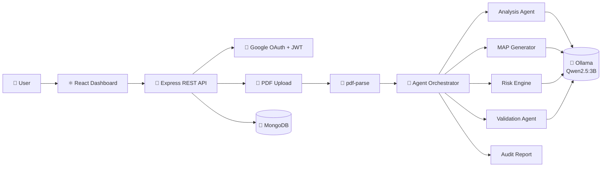

# ReguMind AI

AI-powered regulatory compliance workspace for banks, fintech teams, and compliance officers. ReguMind turns regulatory PDFs into extracted obligations, management action plans, risk scores, and evidence-backed validation records.

## Hackathon Pitch

Regulatory teams receive dense circulars and policy documents that must be converted into action items quickly. Manual review is slow, inconsistent, and difficult to audit.

ReguMind AI provides an end-to-end workflow:

1. Sign in securely with Google.
2. Upload a regulatory PDF.
3. Extract readable text from the document.
4. Analyze obligations using an AI service layer.
5. Generate a Management Action Plan.
6. Score compliance risk.
7. Upload evidence and validate completion.
8. Review everything from a protected dashboard.

## Core Features

- Google OAuth login with JWT-protected backend APIs.
- Protected React dashboard with module-based navigation.
- PDF upload with drag-and-drop UI, upload progress, success, and error states.
- MongoDB-backed document metadata and processing status tracking.
- PDF text extraction with persisted raw text.
- AI-based obligation extraction, summary generation, MAP generation, risk assessment, and evidence validation.
- Document ownership checks for protected document and analysis routes.
- Evidence upload flow with text extraction and compliance validation status.
- Pages for document management, analysis, risk scoring, audit reports, evidence validation, and chatbot.

## Architecture
<div align="center">



</div>

---

<div align="center">



</div>

## Tech Stack

**Frontend**

- React 18
- Vite
- React Router
- Tailwind CSS
- Framer Motion
- React OAuth Google
- Axios
- React Icons

**Backend**

- Node.js
- Express.js
- MongoDB + Mongoose
- JWT authentication
- Google Auth Library
- Multer file uploads
- pdf-parse
- Ollama service integration
- Gemini service/dependency scaffold

## Repository Structure

```text
ReguMind_Project/
|-- backend/
|   |-- src/
|   |   |-- config/          # Database and upload configuration
|   |   |-- controllers/     # Auth and document workflow handlers
|   |   |-- middleware/      # JWT auth middleware
|   |   |-- models/          # User and Document schemas
|   |   |-- routes/          # Auth and document API routes
|   |   |-- services/        # PDF parsing, AI, risk, parser services
|   |   `-- app.js           # Express app setup
|   |-- uploads/             # Uploaded PDFs and evidence files
|   |-- .env.example
|   |-- package.json
|   `-- server.js
|
|-- frontend/
|   |-- src/
|   |   |-- components/      # Auth, protected routes, UI helpers
|   |   |-- pages/           # Login, dashboard, upload, analysis, risk, audit
|   |   |-- services/        # API service clients
|   |   |-- App.jsx          # Client routes
|   |   `-- main.jsx
|   |-- .env.example
|   |-- package.json
|   `-- vite.config.js
|
|-- docs/
|-- PROJECT_STATUS.md
|-- package.json
`-- README.md
```

## User Workflow

```text
Login
  -> Dashboard
  -> Upload PDF
  -> Document List
  -> Extract Text
  -> Analyze Obligations
  -> Generate MAP
  -> Generate Risk Score
  -> Upload Evidence
  -> Validate Compliance
  -> Review Audit/Risk Outputs
```

## Backend API

Base URL:

```text
http://localhost:5000/api
```

### Auth

| Method | Endpoint | Description |
| --- | --- | --- |
| `POST` | `/auth/google` | Verify Google credential and issue JWT |
| `GET` | `/auth/profile` | Return authenticated user profile |

### Documents

All document routes require:

```http
Authorization: Bearer <jwt>
```

| Method | Endpoint | Description |
| --- | --- | --- |
| `POST` | `/documents/upload` | Upload a PDF document |
| `GET` | `/documents` | List documents for the current user |
| `GET` | `/documents/:id` | Get one document with raw text when available |
| `POST` | `/documents/:id/extract` | Extract text from uploaded PDF |
| `POST` | `/documents/:id/analyze` | Generate summary and obligations |
| `GET` | `/documents/:id/analysis` | Fetch saved analysis, MAP, risk, and validation outputs |
| `POST` | `/documents/:id/generate-map` | Generate Management Action Plan |
| `POST` | `/documents/:id/generate-risk` | Generate risk assessment |
| `POST` | `/documents/:id/upload-evidence` | Upload evidence file |
| `POST` | `/documents/:id/validate` | Validate completion using evidence |

## Frontend Routes

| Route | Purpose |
| --- | --- |
| `/login` | Google login |
| `/dashboard` | Main module dashboard |
| `/documents` | Uploaded document list |
| `/upload` | PDF upload workflow |
| `/analysis` and `/analysis/:id` | Document analysis workflow |
| `/risk/:id` | Risk scoring view |
| `/audit/:id` | Audit report view |
| `/evidence` | Evidence validation view |
| `/chatbot` | Chatbot page |

## Local Setup

### Prerequisites

- Node.js 18 or newer
- npm
- MongoDB local instance or MongoDB Atlas URI
- Google OAuth client ID
- Ollama running locally for the current AI workflow, or Gemini credentials if switching to Gemini service

### 1. Clone and Install

```bash
git clone <repo-url>
cd ReguMind_Project
```

Install backend dependencies:

```bash
cd backend
npm install
```

Install frontend dependencies:

```bash
cd ../frontend
npm install
```

### 2. Configure Backend Environment

Create `backend/.env` from `backend/.env.example`:

```env
PORT=5000
MONGODB_URI=mongodb://127.0.0.1:27017/regumind_ai
JWT_SECRET=replace_with_a_secure_secret
GOOGLE_CLIENT_ID=your_google_client_id
GEMINI_API_KEY=your_gemini_api_key_if_using_gemini
OLLAMA_MODEL=qwen2.5:3b
OLLAMA_BASE_URL=http://localhost:11434
```

### 3. Configure Frontend Environment

Create `frontend/.env` from `frontend/.env.example`:

```env
VITE_GOOGLE_CLIENT_ID=your_google_client_id
VITE_API_BASE_URL=http://localhost:5000/api
```

The frontend and backend Google client IDs must match.

### 4. Run Backend

```bash
cd backend
npm run dev
```

Backend health check:

```text
GET http://localhost:5000/
```

Expected response:

```json
{
  "status": "ok",
  "message": "ReguMind AI backend is running"
}
```

### 5. Run Frontend

```bash
cd frontend
npm run dev
```

Open the Vite URL shown in the terminal, usually:

```text
http://localhost:5173
```

## Demo Script

1. Open the frontend and sign in with Google.
2. Go to the dashboard.
3. Upload an RBI circular or regulatory PDF.
4. Open the uploaded document from the document list.
5. Extract PDF text.
6. Run AI analysis to generate summary and obligations.
7. Generate the Management Action Plan.
8. Generate the risk score.
9. Upload evidence for an obligation.
10. Run validation and show the resulting status, confidence, and reason.

## Data Model Highlights

The `Document` model stores:

- PDF metadata: title, original filename, path, file size, MIME type, owner.
- Processing state: upload status, extraction status, analysis status, MAP status, risk status, validation status.
- Extracted content: raw PDF text.
- AI outputs: summary, obligations, MAP items, risk assessment, overall risk score.
- Evidence records: filename, path, extracted evidence text, extraction status.
- Validation result: status, confidence, and reasoning.

## Security Notes

- Authentication uses Google OAuth and backend-issued JWTs.
- Protected routes require `Authorization: Bearer <jwt>`.
- Document queries are scoped to the authenticated user.
- File upload endpoints validate file presence, size limits, and expected PDF MIME type for document uploads.
- Secrets are loaded from `.env` files and should not be committed.

## Current Status

Completed:

- Backend Express setup
- MongoDB integration
- Google OAuth backend flow
- JWT authentication
- Protected frontend routes
- Dashboard and major module pages
- PDF upload API and frontend upload page
- Document metadata storage and listing
- PDF text extraction
- AI summary and obligation extraction workflow
- Management Action Plan generation endpoint
- Risk scoring endpoint
- Evidence upload and validation endpoints

In progress:

- End-to-end testing with real regulatory circulars
- Final frontend polish for analysis, risk, audit, and validation pages
- Choosing final hosted AI provider path for production deployment

## Future Scope

- Production deployment with cloud object storage for PDFs and evidence.
- Role-based access for compliance officer, department owner, auditor, and admin.
- Deadline reminders and task assignment.
- Exportable audit packets in PDF or CSV format.
- Versioned regulatory change tracking.
- Multi-document comparison and duplicate obligation detection.
- Organization-level compliance dashboard.

## Team Notes

This repository is hackathon-ready as a working prototype: frontend, backend, authentication, document workflow, AI workflow, and persistence are implemented locally. Use `PROJECT_STATUS.md` for detailed build progress and remaining integration notes.
